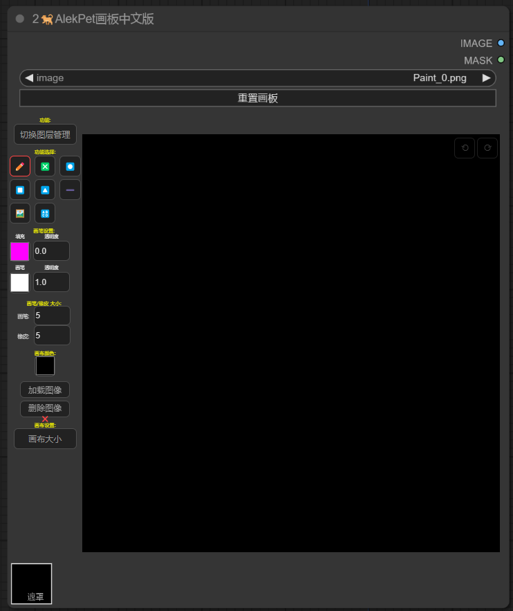

## 安装
Installation

首先，打开命令行终端，然后切换到您的ComfyUI的`custom_nodes`目录：   

```cd /path/to/your/ComfyUI/custom_nodes```

将/path/to/your/ComfyUI替换为您的ComfyUI项目所在的实际路径。   
接下来，克隆Comfyui-AlekPethb-Egzh仓库：   

```git clone https://github.com/11dogzi/Comfyui-AlekPethb-Egzh.git```
      
## 节点介绍 
画板节点来自于[AlekPet项目](https://github.com/AlekPet/ComfyUI_Custom_Nodes_AlekPet)
仅做中文翻译

    

    
